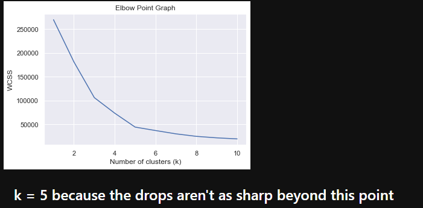
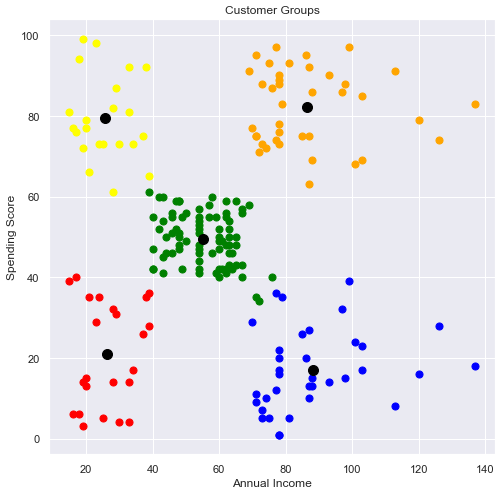

# Customer Clustering
The project analyzes customer data from a shopping mall to identify different segments of customers based on their annual income and spending score. The analysis is performed using the K-means clustering algorithm.

# Languages and Frameworks/Libraries
The project is implemented in Python, using the following libraries/frameworks:

* **numpy**
* **pandas**
* **matplotlib**
* **seaborn**
* **scikit-learn**

# Installation and Execution
1. Clone the repository
2. Install the required dependencies:
```
pip install numpy pandas matplotlib seaborn scikit-learn
```
3. Download the dataset file **Mall_Customers.csv** and place it in the project directory.
4. Run the project

# Configuration
1. After running the project, the program will load the customer data from the "Mall_Customers.csv" file.
2. It will perform exploratory data analysis on the dataset, including data summary, information, and visualization.
3. The program will use the elbow method to determine the optimum number of clusters for the K-means algorithm.
4. It will then apply K-means clustering to segment the customers into different groups based on their annual income and spending score.
5. Finally, the program will visualize the clusters using a scatter plot.

# Snapshots
## Elbow Method to Determine the Value of K


## Sample Scatter-Plot Indicating the Clusters of Customers


# Conclusion
The project successfully analyzes customer data from the shopping mall and identifies different customer segments using K-means clustering. This information can be useful for targeted marketing strategies and personalized customer experiences.
